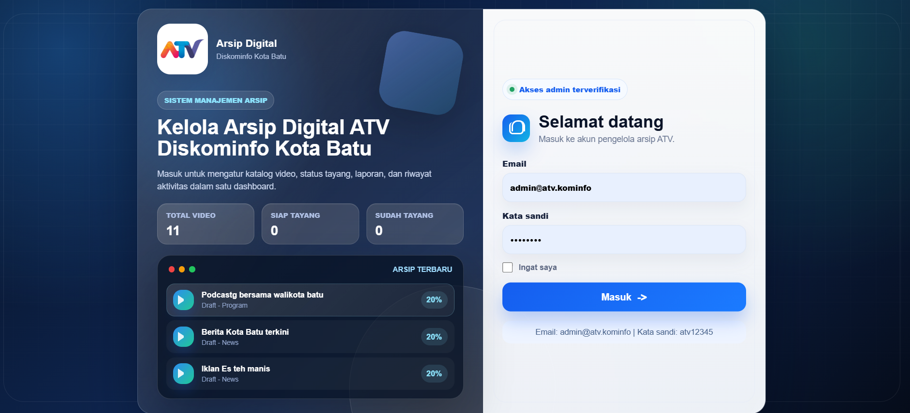
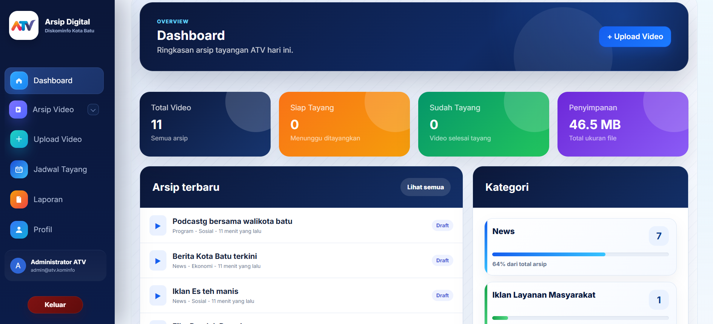
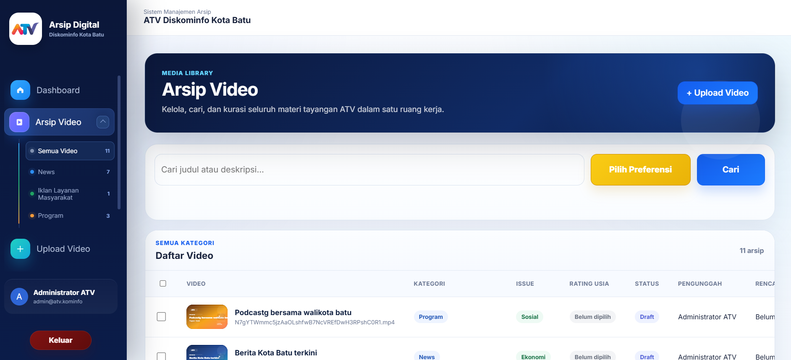
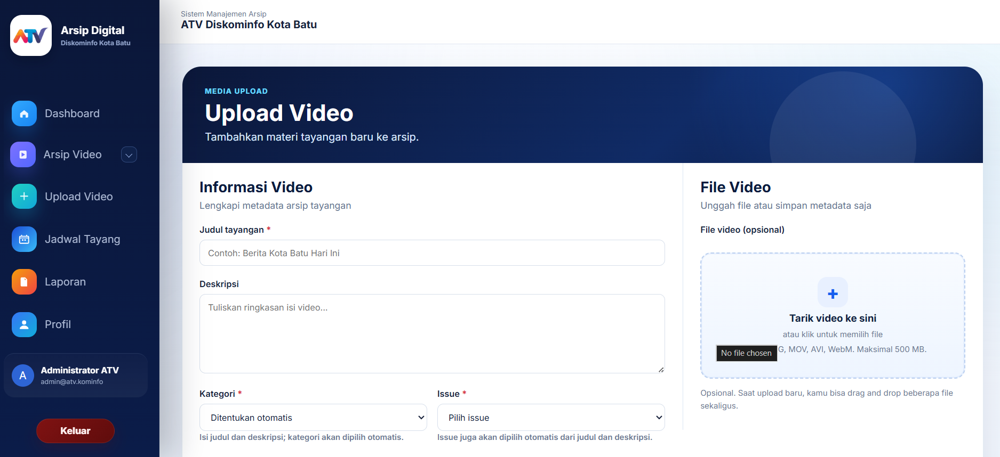
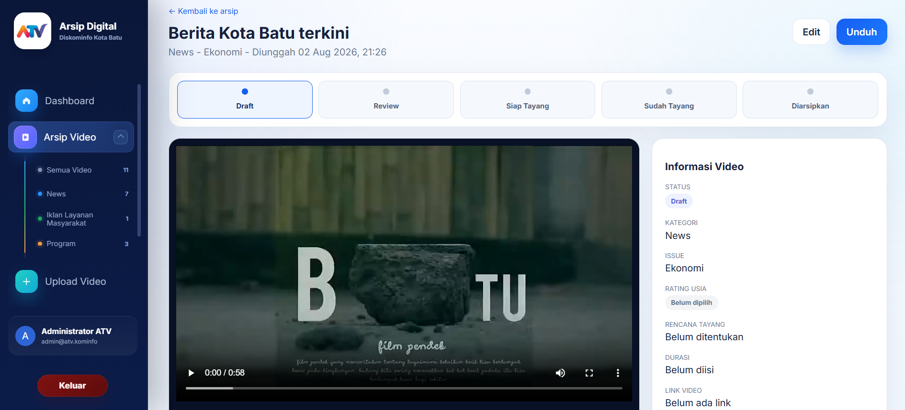
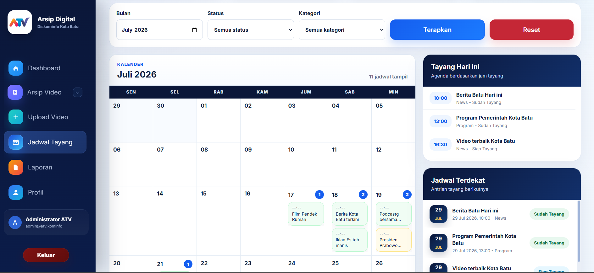
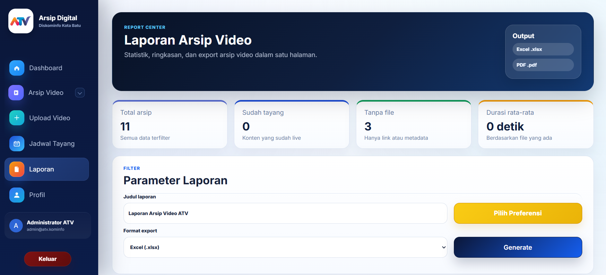
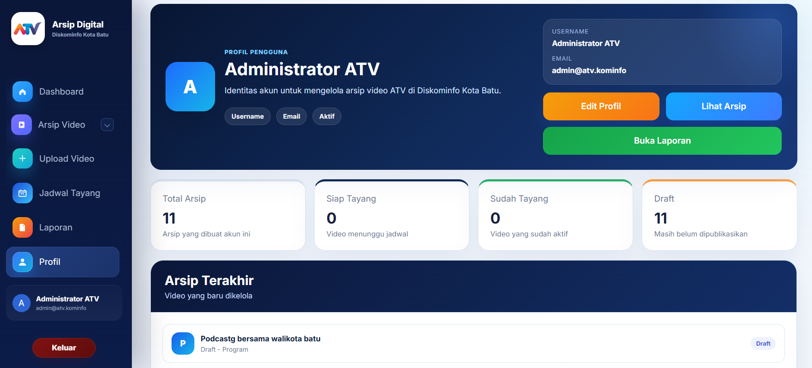

<p align="center">
  
</p>

<h1 align="center">ATV Arsip</h1>

<p align="center">
  Sistem pengelolaan arsip video untuk ATV Diskominfo Kota Batu.
  <br>
  Dibangun dengan Laravel 12, Blade, Tailwind CSS 4, Vite, dan MySQL.
</p>

<p align="center">
  
  
  
  
</p>

---

## Tentang Project

**ATV Arsip** adalah aplikasi internal untuk mengelola dokumentasi video ATV Diskominfo Batu, mulai dari upload arsip, metadata siaran, kategorisasi konten, jadwal tayang, status workflow, riwayat aktivitas, sampai ekspor laporan.

Aplikasi ini dirancang agar tim dapat menjaga arsip video tetap rapi, mudah dicari, siap dipantau, dan bisa dilaporkan dalam format yang siap dibagikan.

## Fitur Utama

| Modul | Deskripsi |
| --- | --- |
| Dashboard | Ringkasan total arsip, konten siap tayang, sudah tayang, ukuran file, tren upload, distribusi kategori, workflow status, dan aktivitas terbaru. |
| Manajemen Arsip | CRUD arsip video dengan metadata lengkap, file video opsional, link video, thumbnail otomatis, durasi, kategori, issue, rating usia, dan jadwal tayang. |
| Upload Multi File | Mendukung upload beberapa video sekaligus dengan judul otomatis per file. |
| Deteksi Kategori | Rekomendasi kategori dan issue berbasis keyword dari judul serta deskripsi. |
| Preview dan Download | Video dapat dipreview inline atau diunduh kembali dari storage publik Laravel. |
| Bulk Action | Ubah status banyak arsip sekaligus atau hapus arsip terpilih. |
| Jadwal Tayang | Kalender tayang bulanan, daftar tayang hari ini, upcoming schedule, dan arsip tanpa jadwal. |
| Laporan | Statistik arsip berdasarkan filter kategori, issue, status, rating usia, dan periode tayang. |
| Ekspor Data | Export arsip dan laporan ke format XLSX atau PDF melalui exporter internal sederhana. |
| Audit Aktivitas | Riwayat create, update, delete, dan auto update status tersimpan di tabel aktivitas. |
| Profil Pengguna | Lihat kontribusi arsip pengguna, edit nama, email, dan password. |
| Autentikasi | Login, logout, dan proteksi route berbasis session Laravel. |

## Tech Stack

| Layer | Teknologi |
| --- | --- |
| Backend | Laravel 12, PHP 8.2+ |
| Frontend | Blade, Tailwind CSS 4, Vite |
| Database | MySQL, compatible dengan database Laravel lain jika konfigurasi disesuaikan |
| Storage | Laravel filesystem public disk |
| Testing | PHPUnit 11 |
| Formatting | Laravel Pint |

## Struktur Aplikasi

```text
app/
  Console/Commands/
    SyncVideoArchiveStatuses.php     # Command auto update status tayang
  Http/Controllers/
    AuthController.php               # Login dan logout
    DashboardController.php          # Statistik dashboard
    VideoArchiveController.php       # CRUD, upload, preview, export arsip
    ScheduleController.php           # Kalender jadwal tayang
    ReportController.php             # Statistik dan export laporan
    ProfileController.php            # Profil pengguna
  Models/
    VideoArchive.php                 # Entity arsip video
    VideoArchiveActivity.php         # Log aktivitas arsip
    User.php                         # Pengguna aplikasi
  Services/
    CategoryDetector.php             # Deteksi kategori dan issue berbasis keyword
    VideoArchiveStatusSyncer.php     # Sinkronisasi status Siap Tayang ke Sudah Tayang
  Support/
    SimplePdfExporter.php            # Generator PDF internal
    SimpleXlsxExporter.php           # Generator XLSX internal

database/
  migrations/                        # Skema users, jobs, cache, arsip, aktivitas
  seeders/DatabaseSeeder.php         # User admin awal

resources/
  views/                             # Blade views untuk auth, dashboard, arsip, laporan, jadwal, profil
  css/app.css                        # Entry CSS Tailwind
  js/app.js                          # Entry JS Vite

routes/
  web.php                            # Route web aplikasi
```

## Model Data

### `video_archives`

Menyimpan arsip utama dengan informasi:

- Pengunggah (`user_id`)
- Judul dan deskripsi
- Kategori: `News`, `Iklan Layanan Masyarakat`, `Program`
- Issue: `Ekonomi`, `Lingkungan`, `Sosial`
- Rating usia: `SU`, `A`, `R`, `D`
- Status workflow: `Draft`, `Review`, `Siap Tayang`, `Sudah Tayang`, `Diarsipkan`
- Jadwal tayang: tanggal dan jam tayang
- File video lokal atau URL video eksternal
- Thumbnail SVG otomatis
- Durasi, nama file asli, MIME type, dan ukuran file

### `video_archive_activities`

Mencatat aktivitas penting pada arsip:

- `created`
- `updated`
- `deleted`
- `auto_status_updated`

Metadata aktivitas disimpan dalam bentuk JSON sehingga perubahan data dapat ditampilkan ulang secara fleksibel.

## Alur Kerja Arsip

```text
Draft
  -> Review
  -> Siap Tayang
  -> Sudah Tayang
  -> Diarsipkan
```

Ketika arsip berstatus **Siap Tayang** dan jadwal tayangnya sudah lewat, sistem dapat mengubah status otomatis menjadi **Sudah Tayang** melalui service `VideoArchiveStatusSyncer`.

Sinkronisasi status dipanggil pada:

- Halaman dashboard
- Halaman daftar arsip
- Command artisan `archives:sync-statuses`

## Route Penting

| Method | Path | Nama Route | Fungsi |
| --- | --- | --- | --- |
| GET | `/` | - | Redirect ke dashboard |
| GET | `/login` | `login` | Form login |
| POST | `/login` | `login.store` | Proses login |
| POST | `/logout` | `logout` | Logout |
| GET | `/dashboard` | `dashboard` | Dashboard utama |
| GET | `/profil` | `profile` | Profil pengguna |
| GET | `/profil/edit` | `profile.edit` | Edit profil |
| PUT | `/profil` | `profile.update` | Update profil |
| GET | `/arsip` | `archives.index` | Daftar arsip |
| GET | `/upload` | `archives.upload` | Form upload arsip |
| POST | `/arsip` | `archives.store` | Simpan arsip |
| GET | `/arsip/{archive}` | `archives.show` | Detail arsip |
| GET | `/arsip/{archive}/edit` | `archives.edit` | Edit arsip |
| PUT/PATCH | `/arsip/{archive}` | `archives.update` | Update arsip |
| DELETE | `/arsip/{archive}` | `archives.destroy` | Hapus arsip |
| POST | `/arsip/bulk-action` | `archives.bulk-action` | Bulk update atau delete |
| GET | `/arsip/export` | `archives.export` | Export arsip XLSX/PDF |
| POST | `/arsip/deteksi-kategori` | `archives.detect-category` | Deteksi kategori dan issue |
| GET | `/arsip/{archive}/preview` | `archives.preview` | Preview file video |
| GET | `/arsip/{archive}/unduh` | `archives.download` | Download file video |
| GET | `/arsip/{archive}/thumbnail` | `archives.thumbnail` | Render thumbnail SVG |
| GET | `/jadwal-tayang` | `schedules.index` | Kalender jadwal tayang |
| GET | `/laporan` | `reports.index` | Dashboard laporan |
| POST | `/laporan/export` | `reports.export` | Export laporan XLSX/PDF |

> Semua route utama kecuali login berada di dalam middleware `auth`.

## Requirement

Pastikan environment lokal sudah memiliki:

- PHP `8.2` atau lebih baru
- Composer
- Node.js dan npm
- MySQL atau database lain yang didukung Laravel
- Extension PHP umum untuk Laravel: `openssl`, `pdo`, `mbstring`, `tokenizer`, `xml`, `ctype`, `json`, `fileinfo`

## Instalasi Lokal

Clone repository, lalu masuk ke folder project.

```bash
git clone <repository-url>
cd atv_diskominfo_batu
```

Install dependency PHP dan JavaScript.

```bash
composer install
npm install
```

Salin file environment.

```bash
cp .env.example .env
```

Untuk PowerShell/Windows:

```powershell
Copy-Item .env.example .env
```

Generate application key.

```bash
php artisan key:generate
```

Atur konfigurasi database di `.env`.

```env
APP_NAME="ATV Arsip"
APP_URL=http://127.0.0.1:8000

DB_CONNECTION=mysql
DB_HOST=127.0.0.1
DB_PORT=3306
DB_DATABASE=atv_diskominfo_batu
DB_USERNAME=root
DB_PASSWORD=

FILESYSTEM_DISK=public
QUEUE_CONNECTION=database
```

Jalankan migration dan seeder.

```bash
php artisan migrate --seed
```

Buat symbolic link storage agar file upload bisa diakses dari public.

```bash
php artisan storage:link
```

Jalankan aplikasi.

```bash
composer run dev
```

Atau jalankan server backend dan frontend secara terpisah.

```bash
php artisan serve
npm run dev
```

Default akses lokal:

```text
http://127.0.0.1:8000
```

## Akun Awal

Seeder membuat dua akun awal:

| Role | Email | Kata Sandi |
| --- | --- | --- |
| Super Admin | `admin@atv.kominfo` | `atv12345` |
| Admin | `staff@atv.kominfo` | `staff12345` |

Super Admin dapat mengelola pengguna, menghapus arsip, dan mengunduh backup data. Admin dapat mengelola arsip, jadwal, laporan, dan profil sesuai akses aplikasi.

Segera ubah kata sandi default setelah login pertama melalui halaman profil, terutama jika aplikasi dipakai di lingkungan produksi.

## Screenshot

Tampilan aplikasi dibuat sebagai dashboard operasional yang bersih, kontras, dan mudah dipindai oleh admin.

### Login



### Dashboard



### Manajemen Arsip



### Upload Arsip



### Detail Arsip



### Jadwal Tayang



### Laporan



### Profil



## Command Operasional

Sinkronisasi status video yang jadwal tayangnya sudah tercapai:

```bash
php artisan archives:sync-statuses
```

Pulihkan arsip dari file thumbnail dan video yang masih tersisa di storage:

```bash
php artisan archives:recover-from-storage
```

Preview data recovery tanpa insert ke database:

```bash
php artisan archives:recover-from-storage --dry-run
```

Build asset produksi:

```bash
npm run build
```

Format kode PHP:

```bash
vendor/bin/pint
```

Jalankan test:

```bash
php artisan test
```

## File Upload

Aplikasi menyimpan file video pada disk `public` Laravel. Setelah menjalankan `php artisan storage:link`, file di `storage/app/public` dapat diakses melalui `public/storage`.

Validasi upload saat ini:

- Format video: MP4, MPEG, MOV, AVI, WebM
- Ukuran maksimal: 500 MB per file
- File video boleh kosong jika arsip hanya memakai metadata atau link video

## Export

Tersedia dua jenis export:

| Export | Format | Catatan |
| --- | --- | --- |
| Arsip Video | XLSX, PDF | Berisi daftar arsip sesuai filter aktif. |
| Laporan | XLSX, PDF | Berisi ringkasan statistik, distribusi kategori, status, rating usia, dan detail arsip. |

Exporter dibuat di dalam project melalui:

- `app/Support/SimpleXlsxExporter.php`
- `app/Support/SimplePdfExporter.php`

Dengan pendekatan ini, project tidak bergantung pada package eksternal khusus untuk export sederhana.

## Backup dan Restore

Backup database wajib dilakukan sebelum menjalankan command yang berpotensi mengubah struktur atau isi database, terutama:

- `php artisan migrate:fresh`
- `php artisan migrate:refresh`
- import database baru
- perubahan migration besar

Super Admin juga dapat mengunduh backup JSON dari aplikasi melalui route:

```text
/backup/data
```

Backup JSON ini berguna untuk arsip data aplikasi dalam format yang mudah dibaca, tetapi file upload tetap harus dibackup terpisah dari folder `storage/app/public`.

### Backup MySQL

```bash
mysqldump -u root atv_diskominfo_batu > backup_atv_diskominfo_batu.sql
```

Jika database memakai password:

```bash
mysqldump -u root -p atv_diskominfo_batu > backup_atv_diskominfo_batu.sql
```

Contoh backup dengan timestamp di PowerShell:

```powershell
mysqldump -u root atv_diskominfo_batu > "backup_atv_diskominfo_batu_$(Get-Date -Format yyyyMMdd_HHmmss).sql"
```

### Restore MySQL

```bash
mysql -u root atv_diskominfo_batu < backup_atv_diskominfo_batu.sql
```

Jika memakai password:

```bash
mysql -u root -p atv_diskominfo_batu < backup_atv_diskominfo_batu.sql
```

### Backup File Upload

Database hanya menyimpan path file. File video dan thumbnail tetap perlu dibackup dari:

```text
storage/app/public
```

Untuk backup manual, salin folder tersebut bersama file dump database.

## Recovery dari Storage

Project menyediakan command darurat untuk merekonstruksi data arsip dari file yang masih ada di `storage/app/public`.

```bash
php artisan archives:recover-from-storage
```

Command ini membaca:

- Thumbnail SVG dari `storage/app/public/thumbnails`
- Video dari `storage/app/public/videos`
- Judul, kategori, dan issue dari teks yang tersimpan di thumbnail
- Ukuran file dan MIME type dari file video

Command ini aman untuk dijalankan ulang karena akan melewati arsip yang sudah punya `thumbnail_path` atau `file_path` yang sama.

Gunakan mode preview sebelum recovery:

```bash
php artisan archives:recover-from-storage --dry-run
```

Batasan recovery:

- Deskripsi asli tidak bisa dipulihkan dari storage
- Status asli tidak bisa dipastikan
- Tanggal dan jam tayang asli tidak tersedia
- Rating usia asli tidak tersedia
- Nama file asli upload tidak tersedia jika database sebelumnya hilang
- Activity log lama tidak bisa dikembalikan tanpa backup database

Data hasil recovery dibuat dengan nilai default:

| Field | Nilai Default |
| --- | --- |
| `status` | `Draft` |
| `description` | `Dipulihkan dari file storage setelah database ter-reset.` |
| `age_rating` | `null` |
| `air_date` | `null` |
| `air_time` | `null` |
| `original_name` | Nama file storage saat ini |

Setelah recovery, lengkapi kembali metadata yang hilang melalui halaman edit arsip.

## Scheduler

Command `archives:sync-statuses` dapat dijalankan manual, tetapi untuk produksi sebaiknya dipanggil otomatis oleh Laravel scheduler.

Scheduler command sudah didaftarkan di `routes/console.php`:

```php
use Illuminate\Support\Facades\Schedule;

Schedule::command('archives:sync-statuses')->everyMinute();
```

Lalu aktifkan cron server:

```bash
* * * * * cd /path/to/project && php artisan schedule:run >> /dev/null 2>&1
```

Untuk Windows Task Scheduler atau Laragon lokal, buat task yang menjalankan:

```powershell
php artisan schedule:run
```

Pastikan task dijalankan dari folder project.

Jika scheduler tidak berjalan, status arsip tetap bisa berubah ketika halaman dashboard atau daftar arsip dibuka, tetapi proses otomatis di server tidak akan konsisten.

## Konfigurasi Produksi

Contoh konfigurasi `.env` untuk server produksi:

```env
APP_NAME="ATV Arsip"
APP_ENV=production
APP_KEY=base64:...
APP_DEBUG=false
APP_URL=https://domain-aplikasi.example

DB_CONNECTION=mysql
DB_HOST=127.0.0.1
DB_PORT=3306
DB_DATABASE=atv_diskominfo_batu
DB_USERNAME=nama_user_database
DB_PASSWORD=password_database

FILESYSTEM_DISK=public
QUEUE_CONNECTION=database
SESSION_DRIVER=database
CACHE_STORE=database
```

Pastikan `APP_URL` sesuai domain produksi karena URL asset, storage, dan redirect bergantung pada konfigurasi ini.

## Keamanan

- Ubah password default setelah instalasi pertama.
- Jangan memakai akun seed default untuk produksi jangka panjang.
- Set `APP_DEBUG=false` di server produksi.
- Pastikan `.env` tidak pernah masuk repository.
- Batasi akses server hanya untuk pengguna internal yang berwenang.
- Backup database dan `storage/app/public` secara rutin.
- Validasi ukuran upload server web agar selaras dengan batas aplikasi 500 MB per file.
- Gunakan HTTPS jika aplikasi diakses melalui jaringan publik.

## Testing

Test feature yang tersedia:

- `tests/Feature/ArchiveManagementTest.php`
- `tests/Feature/AdminUserManagementTest.php`
- `tests/Feature/DashboardAndBackupTest.php`
- `tests/Feature/ErrorPageTest.php`
- `tests/Feature/ProfileManagementTest.php`
- `tests/Feature/ReportManagementTest.php`
- `tests/Feature/ScheduleAndPreviewTest.php`

Jalankan semua test:

```bash
php artisan test
```

Jalankan test tertentu:

```bash
php artisan test --filter=AdminUserManagementTest
php artisan test --filter=ArchiveManagementTest
php artisan test --filter=DashboardAndBackupTest
php artisan test --filter=ReportManagementTest
php artisan test --filter=ScheduleAndPreviewTest
```

## Troubleshooting

### File upload tidak muncul

Pastikan symbolic link storage sudah dibuat.

```bash
php artisan storage:link
```

Pastikan `.env` menggunakan disk yang benar.

```env
FILESYSTEM_DISK=public
```

### Login gagal setelah fresh install

Jalankan seeder ulang.

```bash
php artisan migrate:fresh --seed
```

Gunakan akun:

```text
Super Admin : admin@atv.kominfo / atv12345
Admin       : staff@atv.kominfo / staff12345
```

### Asset CSS atau JS tidak berubah

Jalankan Vite.

```bash
npm run dev
```

Untuk produksi, build ulang asset.

```bash
npm run build
```

### Status tidak otomatis berubah ke Sudah Tayang

Jalankan command sinkronisasi.

```bash
php artisan archives:sync-statuses
```

Jika ingin otomatis periodik di server produksi, ikuti bagian **Scheduler**.

## Deployment Checklist

- Backup database dan folder `storage/app/public` sebelum update
- Set `.env` produksi dengan `APP_ENV=production`, `APP_DEBUG=false`, dan `APP_URL` domain asli
- Pastikan database produksi sudah dibuat
- Jalankan `composer install --no-dev --optimize-autoloader`
- Jalankan `php artisan key:generate` jika belum ada `APP_KEY`
- Jalankan `php artisan migrate --force`
- Jalankan `php artisan storage:link`
- Jalankan `npm ci` dan `npm run build`
- Pastikan cron atau Windows Task Scheduler menjalankan `php artisan schedule:run`
- Ubah kata sandi akun seed default
- Jalankan optimasi Laravel:

```bash
php artisan config:cache
php artisan route:cache
php artisan view:cache
```

## Catatan Pengembangan

- Gunakan model `VideoArchive` sebagai sumber nilai enum kategori, issue, status, dan rating usia agar konsisten di controller dan view.
- Semua perubahan arsip yang penting sebaiknya dicatat ke `VideoArchiveActivity`.
- Jika menambah filter baru di arsip atau laporan, pastikan export XLSX/PDF mengikuti filter yang sama.
- Jika menambah status workflow baru, perbarui `VideoArchive::STATUSES`, warna/status breakdown di `ReportController`, dan logika `VideoArchiveStatusSyncer` bila relevan.

## Lisensi

Project ini menggunakan fondasi Laravel yang berlisensi MIT. Kebijakan lisensi untuk kode aplikasi internal mengikuti aturan pemilik repository.
